<div align="center">
  
</div>

<br>

<!-- whoami -->

```js
const joe = {
  role:       "Marketing & Sales Automation Builder",
  based:      "Belgium 🇧🇪",
  focus:      ["GoHighLevel", "Prospecting systems", "AI tooling"],
  philosophy: "If I do it twice, I automate it.",
  building:   "in public, one workflow at a time",
};
```

<br>

## ⚙️ &nbsp;What I actually build

> Less clicking, more closing. I turn repetitive marketing & sales work into systems that run on their own.

- **GoHighLevel** - workflows, dashboards and sub-account tooling that scale across clients
- **Prospecting engines** - tracking systems and pipelines that keep outreach moving
- **AI-assisted tooling** - Claude-powered scripts that compress hours of grunt work into minutes

<br>

## 🧰 &nbsp;Toolbox

<p>
  
</p>

<br>

## 🚀 &nbsp;Featured work

<table>
  <tr>
    <td valign="top">
      <h3>🧩 GHL AI Studio Exporter</h3>
      <p><b>Chrome extension that backs up GoHighLevel AI Studio projects to GitHub in one click.</b><br>
      MV3, vanilla JS, OAuth Device Flow, atomic pushes through the Git Data API.</p>
      <a href="https://github.com/joe-jns/ghl-aistudio-exporter"></a>
      &nbsp;<code>JavaScript</code> &nbsp;<code>Chrome&nbsp;MV3</code>
    </td>
  </tr>
</table>

<sub>↗ &nbsp;More small, sharp automation tools on my <a href="https://github.com/joe-jns?tab=repositories">repositories</a>.</sub>

<br>

---

<div align="center">
  <sub>💬 &nbsp;A process eating your time? There's almost always a way to automate it.</sub>
  <br><br>
  <a href="mailto:github@joe.yt"></a>
</div>
